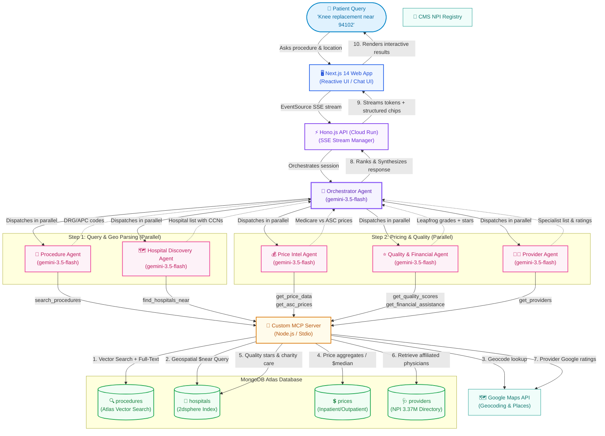

# ClearPrice — Hospital Price Transparency Agent

> **The data was always public. We just made it human.**

Since 2021, US hospitals are legally required to publish their prices. The problem: they're buried in 500,000-row CSV files with cryptic billing codes that no patient can read.

ClearPrice is a multi-agent AI system that turns that public data into plain-English answers in under 10 seconds.

**Ask:** *"What will a knee replacement cost near zip 94102?"*
**Get:** A ranked comparison of real Medicare payment rates, CMS quality scores, physician ratings, and charity care options — across every hospital near you.

---

## Live Demo

→ **[clearprice.app](https://clearprice.app)** *(replace with your Cloud Run URL after deploy)*

---

## Built For

[Google Cloud Rapid Agent Hackathon 2026](https://rapid-agent.devpost.com/) · MongoDB $10K Prize Track · Deadline June 11, 2026

| Requirement | Implementation |
|-------------|---------------|
| Google Cloud Agent Builder | Google ADK agents deployed to Vertex AI Agent Runtime |
| Gemini Models | `gemini-3.5-flash` via Vertex AI |
| Partner MCP server | Custom MCP server exposing MongoDB Atlas as domain tools |
| Real-world impact | Hospital price transparency for 100M+ Americans with medical debt |

---

## How It Works



**Total: ~8 seconds end-to-end.** Procedure + Hospital agents run in parallel (Step 1), then Price + Quality + Provider run in parallel (Step 2).

---

## Why This Matters

- **100M Americans** carry medical debt — most had no idea what care would cost
- **2x–5x price variation** for identical procedures between hospitals in the same city
- **The law already requires transparency** — hospitals just publish it in formats nobody can use
- **ASCs are 30–60% cheaper** for the same outpatient procedure — most patients never know they exist

---

## Architecture

```
/
├── agents/          Google ADK multi-agent system (TypeScript)
│   ├── src/orchestrator.ts
│   ├── src/procedure-agent.ts        NL → DRG/APC codes
│   ├── src/hospital-discovery-agent.ts   Geo search
│   ├── src/price-intel-agent.ts      Pricing data
│   ├── src/quality-financial-agent.ts    CMS stars + charity care
│   └── src/provider-agent.ts         Physician directory
│
├── mcp-server/      Custom MCP Server (MongoDB Atlas tools)
│   └── src/tools/
│       ├── searchProcedures.ts    Atlas Vector Search: NL → codes
│       ├── findHospitalsNear.ts   $near geo query
│       ├── getPriceData.ts        Aggregation pipeline + $median
│       ├── getAscPrices.ts        Surgery center alternative prices
│       ├── getQualityScores.ts    CMS + Leapfrog grades
│       ├── getFinancialAssistance.ts  Charity care ratios (HCRIS)
│       ├── getProviders.ts        NPI physician directory
│       └── rankHospitals.ts       Composite score: price+quality+distance
│
├── api/             Hono.js REST API + SSE streaming (Cloud Run)
│   └── src/routes/
│       ├── chat.ts      POST /api/chat  — SSE event stream to agents
│       ├── hospitals.ts GET /api/hospitals/search — map data
│       └── prices.ts    GET /api/prices/compare — comparison table
│
├── frontend/        Next.js 14 App Router (Cloud Run)
│   └── src/app/
│       ├── page.tsx         Landing page (you are here)
│       ├── app/page.tsx     Split-pane chat + live results
│       ├── compare/page.tsx Direct price comparison table
│       └── map/page.tsx     Hospital map with quality pins
│
└── ingestion/       One-time data pipeline scripts
    ├── inpatient-sync.ts    CMS Medicare Inpatient CSV → prices (DRG)
    ├── outpatient-sync.ts   CMS Medicare Outpatient CSV → prices (APC)
    ├── hospital-compare-sync.ts  Hospital quality + geocoding
    ├── asc-sync.ts          Ambulatory Surgery Center prices
    ├── doctors-sync.ts      NPI provider directory (3.37M records)
    └── embed-procedures.ts  Vertex AI embeddings for vector search
```

---

## Data Sources

All free, all public — no synthetic data.

| Source | What it provides | Volume |
|--------|-----------------|--------|
| [CMS Medicare Inpatient (DRG)](https://data.cms.gov) | What Medicare paid per hospital per DRG procedure | 145K+ records |
| [CMS Medicare Outpatient (APC)](https://data.cms.gov) | Outpatient procedure payments | 116K+ records |
| [CMS Hospital General Information](https://data.cms.gov/provider-data) | Quality stars, addresses, CCN join key | 5,400+ hospitals |
| [Leapfrog Hospital Safety Grades](https://leapfroggroup.org) | A–F safety letter grades | 3,000+ hospitals |
| [HCRIS Cost Reports](https://data.cms.gov/provider-compliance) | Charity care costs, uncompensated care | 3,000+ hospitals |
| [NPI Registry API](https://npiregistry.cms.hhs.gov) | 3.37M physician records, free, no key | 3.37M providers |
| [Google Places API](https://developers.google.com/maps) | Consumer ratings for hospitals and providers | Per-request |

---

## Getting Started

### Prerequisites

- Node.js 22+
- Docker (for local MongoDB) or MongoDB Atlas M10+
- Google Cloud project with Vertex AI enabled
- Google Maps API key (Geocoding API + Maps JavaScript API)

### 1. Clone and install

```bash
git clone https://github.com/yourusername/clearprice.git
cd clearprice
npm install -ws
```

### 2. Configure environment

```bash
cp .env.example .env
```

Fill in `.env`:

```bash
# Google Cloud / Vertex AI
GCP_PROJECT_ID=your-gcp-project-id
VERTEX_AI_LOCATION=us-central1

# MongoDB
MONGODB_URI=mongodb://localhost:27017   # or Atlas URI
MONGODB_DATABASE=clearprice

# APIs
GOOGLE_MAPS_API_KEY=your-key-here      # Geocoding + Maps JavaScript API

# Frontend (set automatically in production via deploy.sh)
NEXT_PUBLIC_API_URL=http://localhost:8080
```

### 3. Start local MongoDB

```bash
docker run -d -p 27017:27017 --name clearprice-mongo mongo:7
```

### 4. Ingest data

Downloads CMS datasets and loads into MongoDB (~30 min, mostly download time):

```bash
# Core pricing data — required
npm run ingest:inpatient -w @clearprice/ingestion
npm run ingest:outpatient -w @clearprice/ingestion

# Hospital quality + geocoding (requires Maps API key)
npm run ingest:hospitals -w @clearprice/ingestion

# Ambulatory Surgery Centers
npm run ingest:asc -w @clearprice/ingestion

# Provider directory
# First download DAC_NationalDownloadableFile.csv from https://data.cms.gov/provider-data
# Place in /tmp/cms_doctors.csv, then:
npm run ingest:doctors -w @clearprice/ingestion

# Seed procedure collection + embeddings (requires GCP_PROJECT_ID)
npm run ingest:embed -w @clearprice/ingestion
```

### 5. Build MCP server

```bash
npm run build -w @clearprice/mcp-server
```

### 6. Start all services

```bash
# Terminal 1 — API (includes agent runner)
npm run dev -w @clearprice/api

# Terminal 2 — Frontend
npm run dev -w @clearprice/frontend
```

Open [http://localhost:3000](http://localhost:3000)

### 7. Test agents directly (CLI)

```bash
npm run test:agent -w @clearprice/agents
# > "knee replacement near 94102"
```

---

## MongoDB Atlas Setup (Production)

Atlas M10+ is required for Vector Search and the `$median` aggregation operator.

1. Create cluster at [cloud.mongodb.com](https://cloud.mongodb.com) — **M10 minimum**
2. **Database Access**: create a user with read/write to `clearprice`
3. **Network Access**: add `0.0.0.0/0` (Cloud Run IPs are dynamic)
4. Update `MONGODB_URI` in `.env` with your Atlas connection string
5. Re-run ingestion scripts pointing at Atlas
6. Create indexes in Atlas UI or run:

```javascript
// In Atlas Shell or mongosh
use clearprice

db.hospitals.createIndex({ location: "2dsphere" })
db.hospitals.createIndex({ ccn: 1 }, { unique: true })
db.prices.createIndex({ procedure_code: 1, hospital_ccn: 1, cms_year: 1 }, { unique: true })
db.providers.createIndex({ npi: 1 }, { unique: true })
db.providers.createIndex({ hospital_ccn: 1, taxonomy_code: 1 })
db.sessions.createIndex({ ttl: 1 }, { expireAfterSeconds: 0 })

// Atlas Search index — create via Atlas UI
// Collection: procedures, field: embedding, type: vector, dimensions: 768
```

---

## Deploy to Cloud Run

Requires `gcloud` CLI authenticated with billing enabled.

```bash
# One command deploys everything in the right order
./deploy.sh
```

Deploys:
1. `clearprice-mcp` — MCP Server
2. `clearprice-api` — Hono API (wired to MCP URL automatically)
3. `clearprice-frontend` — Next.js (wired to API URL automatically)

```
Output:
  App:     https://clearprice-frontend-abc123.run.app
  API:     https://clearprice-api-abc123.run.app
  MCP:     https://clearprice-mcp-abc123.run.app
```

---

## MongoDB Features Used

| Feature | Location | Demo moment |
|---------|----------|-------------|
| **Atlas Vector Search** | `searchProcedures` tool | "knee replacement" → DRG 470 |
| **Aggregation `$median`** | `getPriceData` tool | National benchmark price |
| **Full-Text Search** | Hospital autocomplete UI | Search-as-you-type |
| **Geospatial `$near`** | `findHospitalsNear` tool | Hospitals within 25 miles |
| **`$group` + `$project`** | Price comparison pipeline | Multi-hospital price rollup |
| **Compound Indexes** | prices collection | Sub-100ms on 260K docs |
| **TTL Index** | sessions collection | Auto-expiring session privacy |
| **2dsphere Index** | hospitals collection | Geospatial queries |

---

## Known Limitations

| Limitation | Detail |
|------------|--------|
| Medicare data only | Not your insurer's negotiated rate. Commercial rates are typically 150–300% of Medicare. |
| Averages, not quotes | Prices are hospital-level averages across all similar cases in a year, not individual cost estimates. |
| 1–2 year data lag | CMS publishes annually. Data reflects 2022–2024 depending on dataset. |
| Not medical advice | ClearPrice shows costs. It does not recommend providers or treatments. |
| Rural coverage gaps | Critical Access Hospitals report differently. Metro area coverage is strongest. |
| Google Ratings | Only populated for hospitals that ran the Places sync. |

---

## Environment Variables

```bash
# .env.example
GCP_PROJECT_ID=
VERTEX_AI_LOCATION=us-central1

MONGODB_URI=mongodb://localhost:27017
MONGODB_DATABASE=clearprice

GOOGLE_MAPS_API_KEY=

NODE_ENV=development
PORT=8080
ALLOWED_ORIGINS=http://localhost:3000
```

---

## License

MIT — source data from CMS.gov (US public domain).

*Prices shown are estimates based on publicly available Medicare payment data. Actual costs depend on your specific insurance plan, deductible, network status, and individual clinical circumstances. Always verify costs with your insurer and provider before receiving care.*
